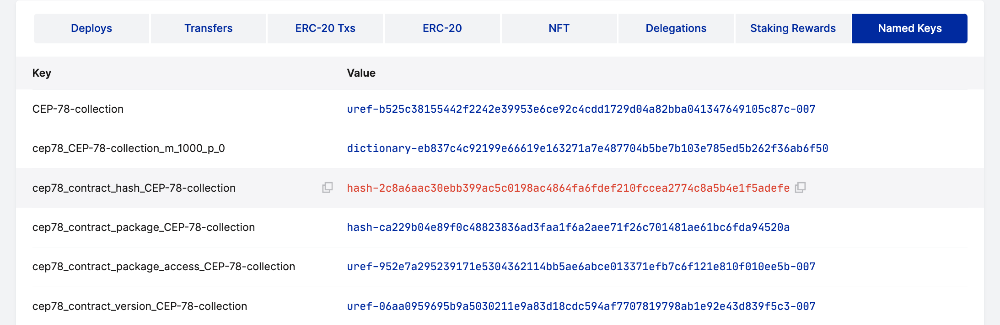

# Querying NFT Contracts

This document covers different commands to query and interact with an NFT (CEP-78) contract instance.

## Prerequisites

- Install the contract using the [Quickstart](./quickstart-guide.md) or the [Full Installation](./full-installation-tutorial.md) tutorials

## Querying the Contract

First, identify the contract hash by looking at the account that installed the contract. Under the account's named keys, you will see a named key for the contract hash, which represents the stored contract. Copy this value and save it for future queries.

<div align="center">

</div>

<br>

Next, query the contract details.

```bash
casper-client query-global-state -n http://<HOST:PORT> \
// This is the contract hash, which can be found within the `NamedKeys` of the account that sent the installing deploy.
--key hash-30767a108fedcb8872a0cec5eabb76f743f1bf3bbac9cac6e9c15355ae17d61a \
// This is the most up to date state root hash, which can found by using the `get-state-root-hash` command in the Casper client.
--state-root-hash ca9ad2c99188cdbb8ceeccff16c6225b53b8c2e01dff945fb7ff3e33b427faf5
```

<details>
<summary><b>Casper client command without comments</b></summary>

```bash
casper-client query-global-state -n https://rpc.testnet.casperlabs.io/ \
--key hash-30767a108fedcb8872a0cec5eabb76f743f1bf3bbac9cac6e9c15355ae17d61a \
--state-root-hash ca9ad2c99188cdbb8ceeccff16c6225b53b8c2e01dff945fb7ff3e33b427faf5
```

</details>
<br>

<details>
<summary><b>Expand to see the contract</b></summary>

```json
{
  "jsonrpc": "2.0",
  "id": -5249732042108614691,
  "result": {
    "api_version": "1.5.6",
    "block_header": null,
    "stored_value": {
      "Contract": {
        "contract_package_hash": "contract-package-c6bb687a72d0aa341317ef85cc8668c6627f0c1e8233ead4aa97e0399c9366ea",
        "contract_wasm_hash": "contract-wasm-f8fadaf90a26db147a56005891b2fc7f33c90ea4d39f533078be36894d99cff1",
        "named_keys": [
          {
            "name": "allow_minting",
            "key": "uref-f4aa245fb70fdc6557cbbc61703629f616a2d5c270ee0c427147947d8cd8b12c-007"
          },
          {
            "name": "balances",
            "key": "uref-953333e2c0249bd7db687b43cb2585d0ad5356eb7be6c4f56479070d3c33c1dd-007"
          },
          {
            "name": "burn_mode",
            "key": "uref-9791a13ce6c3d3251607073c75fb548dcf70a6a84f2847845b08b7e797a9b40b-007"
          },
          {
            "name": "burnt_tokens",
            "key": "uref-704d3105e3ee90e3f072f04333dd1644a3617013588981b18fa01afe570b6a97-007"
          },
          {
            "name": "collection_name",
            "key": "uref-2957503e067a14bb8017b17af807699998b17cb2889a351dce8aeb8d6c4672fd-007"
          },
          {
            "name": "collection_symbol",
            "key": "uref-be0d965414348f285c698dc67371a7dbc8974d4cd957f1cf162f0d6ce2fe215b-007"
          },
          {
            "name": "contract_whitelist",
            "key": "uref-b2dd80cc9ea15fee10c841e49eb2db724ca4af85b47be5d37793994d879e97ec-007"
          },
          {
            "name": "holder_mode",
            "key": "uref-a561a0171e7bfffcfe7c8e487c0f4e3528a807152c27d5b235445a3aad21a016-007"
          },
          {
            "name": "identifier_mode",
            "key": "uref-5f7b8694da08e7b7c9f7613cd02da4c19aa0f3b26db033c09e4d42920a5f284d-007"
          },
          {
            "name": "installer",
            "key": "account-hash-5cb74580bcf97d0a7fa034e60b3d2952e0b170ea5162153b1570e8b1ee4ec3f5"
          },
          {
            "name": "json_schema",
            "key": "uref-fcc796a2d21efbbf777d1e5f1e6436ab4b0ba9a308c63502b0a26f82b4e53f21-007"
          },
          {
            "name": "metadata_cep78",
            "key": "uref-64e0268f09395f215ee71dd668ac3e6f8fbf6b9340ee88d0e5381996ae577c0e-007"
          },
          {
            "name": "metadata_custom_validated",
            "key": "uref-000c5609c2f884d4ae1bb3406f3ba1a9ce5fbe03eaa8dd6edd6d42ea7d4e43e9-007"
          },
          {
            "name": "metadata_mutability",
            "key": "uref-eabf6aa4701272e56012b3567403434368aac7f6d43b5c26cc3ab5b29e96d14b-007"
          },
          {
            "name": "metadata_nft721",
            "key": "uref-585836baca4e24d53234671c7e70ab1f5d2d8ed9e6eb083218365d71700f7626-007"
          },
          {
            "name": "metadata_raw",
            "key": "uref-5d7a570165127633392eb40e8b899fa7d5f0fc90f589e6d425994aac050a7cae-007"
          },
          {
            "name": "minting_mode",
            "key": "uref-81a08d4b64c0a8c08ef75b164da3ae3914883224857632ab4f476f386e853d01-007"
          },
          {
            "name": "nft_kind",
            "key": "uref-a50039ae7e9191fed14bff1b1404538189894d2bf7d279672c1b0ec4e7f6441b-007"
          },
          {
            "name": "nft_metadata_kind",
            "key": "uref-0c8b9018f09e90d2823134cdf0d70cdec08decaaa822aa1311e79242b616e4d3-007"
          },
          {
            "name": "number_of_minted_tokens",
            "key": "uref-c02c67cc721aa82ecd70adae2647b94125dde3fb4899a44ab03c944f3dfe7923-007"
          },
          {
            "name": "operator",
            "key": "uref-6ced629a6c54e24ca0a2c4af0cce2a69139fac7461294234bd91b442886e0c13-007"
          },
          {
            "name": "owned_tokens",
            "key": "uref-456e98216d72a0a1a0427fb6ddf4cc7070d1450faa841cf381c821c415092228-007"
          },
          {
            "name": "ownership_mode",
            "key": "uref-b23f6166e076cc347ab0ba68343e51d3ecf9808e6a960386f5fc8af8cdce4df8-007"
          },
          {
            "name": "receipt_name",
            "key": "uref-006512abe036cf2b923418a22c426fd59d88a812a8e3c478c630faa376e20832-007"
          },
          {
            "name": "token_issuers",
            "key": "uref-5ba273a67b785a6580d0784362f09761c4bb9f0e261c8a583e74af0ab68fe010-007"
          },
          {
            "name": "token_owners",
            "key": "uref-962891f947726ef87e6988d26ae5bb65c1376520278a149ea0044aafc94f3a91-007"
          },
          {
            "name": "total_token_supply",
            "key": "uref-e2116be250c30901324f4590683774a83577a51b174274d371c38d574b065d90-007"
          },
          {
            "name": "whitelist_mode",
            "key": "uref-ab9b9c51e591e56e8042a1ae6649dad31d52be6febc4aba62c414ff069089bf6-007"
          }
        ],
        "entry_points": [
          {
            "name": "approve",
            "args": [
              {
                "name": "operator",
                "cl_type": "Key"
              }
            ],
            "ret": "Unit",
            "access": "Public",
            "entry_point_type": "Contract"
          },
          {
            "name": "balance_of",
            "args": [
              {
                "name": "token_owner",
                "cl_type": "Key"
              }
            ],
            "ret": "U64",
            "access": "Public",
            "entry_point_type": "Contract"
          },
          {
            "name": "burn",
            "args": [],
            "ret": "Unit",
            "access": "Public",
            "entry_point_type": "Contract"
          },
          {
            "name": "get_approved",
            "args": [],
            "ret": {
              "Option": "Key"
            },
            "access": "Public",
            "entry_point_type": "Contract"
          },
          {
            "name": "init",
            "args": [
              {
                "name": "collection_name",
                "cl_type": "String"
              },
              {
                "name": "collection_symbol",
                "cl_type": "String"
              },
              {
                "name": "total_token_supply",
                "cl_type": "U64"
              },
              {
                "name": "allow_minting",
                "cl_type": "Bool"
              },
              {
                "name": "minting_mode",
                "cl_type": "U8"
              },
              {
                "name": "ownership_mode",
                "cl_type": "U8"
              },
              {
                "name": "nft_kind",
                "cl_type": "U8"
              },
              {
                "name": "holder_mode",
                "cl_type": "U8"
              },
              {
                "name": "whitelist_mode",
                "cl_type": "U8"
              },
              {
                "name": "contract_whitelist",
                "cl_type": {
                  "List": {
                    "ByteArray": 32
                  }
                }
              },
              {
                "name": "json_schema",
                "cl_type": "String"
              },
              {
                "name": "receipt_name",
                "cl_type": "String"
              },
              {
                "name": "identifier_mode",
                "cl_type": "U8"
              },
              {
                "name": "burn_mode",
                "cl_type": "U8"
              }
            ],
            "ret": "Unit",
            "access": "Public",
            "entry_point_type": "Contract"
          },
          {
            "name": "metadata",
            "args": [],
            "ret": "String",
            "access": "Public",
            "entry_point_type": "Contract"
          },
          {
            "name": "mint",
            "args": [
              {
                "name": "token_owner",
                "cl_type": "Key"
              },
              {
                "name": "token_meta_data",
                "cl_type": "String"
              }
            ],
            "ret": {
              "Tuple3": [
                "String",
                "Key",
                "String"
              ]
            },
            "access": "Public",
            "entry_point_type": "Contract"
          },
          {
            "name": "owner_of",
            "args": [],
            "ret": "Key",
            "access": "Public",
            "entry_point_type": "Contract"
          },
          {
            "name": "set_approval_for_all",
            "args": [
              {
                "name": "token_owner",
                "cl_type": "Key"
              },
              {
                "name": "approve_all",
                "cl_type": "Bool"
              },
              {
                "name": "operator",
                "cl_type": "Key"
              }
            ],
            "ret": "Unit",
            "access": "Public",
            "entry_point_type": "Contract"
          },
          {
            "name": "set_token_metadata",
            "args": [
              {
                "name": "token_meta_data",
                "cl_type": "String"
              }
            ],
            "ret": "Unit",
            "access": "Public",
            "entry_point_type": "Contract"
          },
          {
            "name": "set_variables",
            "args": [
              {
                "name": "allow_minting",
                "cl_type": "Bool"
              },
              {
                "name": "contract_whitelist",
                "cl_type": {
                  "List": {
                    "ByteArray": 32
                  }
                }
              }
            ],
            "ret": "Unit",
            "access": "Public",
            "entry_point_type": "Contract"
          },
          {
            "name": "transfer",
            "args": [
              {
                "name": "source_key",
                "cl_type": "Key"
              },
              {
                "name": "target_key",
                "cl_type": "Key"
              }
            ],
            "ret": {
              "Tuple2": [
                "String",
                "Key"
              ]
            },
            "access": "Public",
            "entry_point_type": "Contract"
          }
        ],
        "protocol_version": "1.4.10"
      }
    },
    "merkle_proof": "[31286 hex chars]"
  }
}
```

</details>

## Next Steps

- [NFT Transfers](./transfer.md)