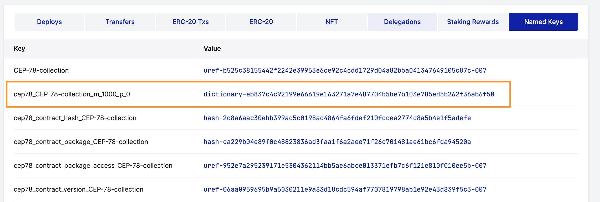
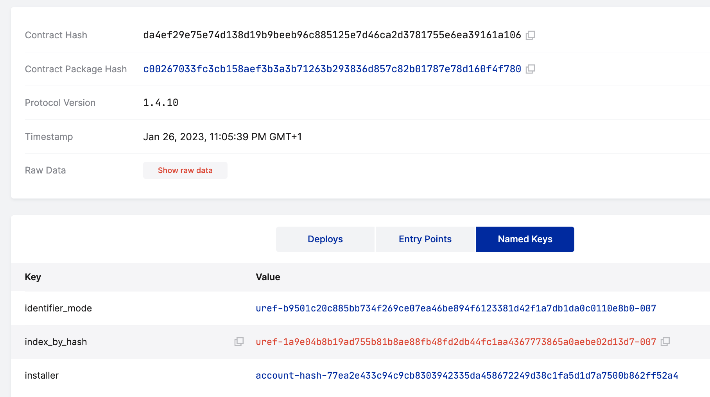
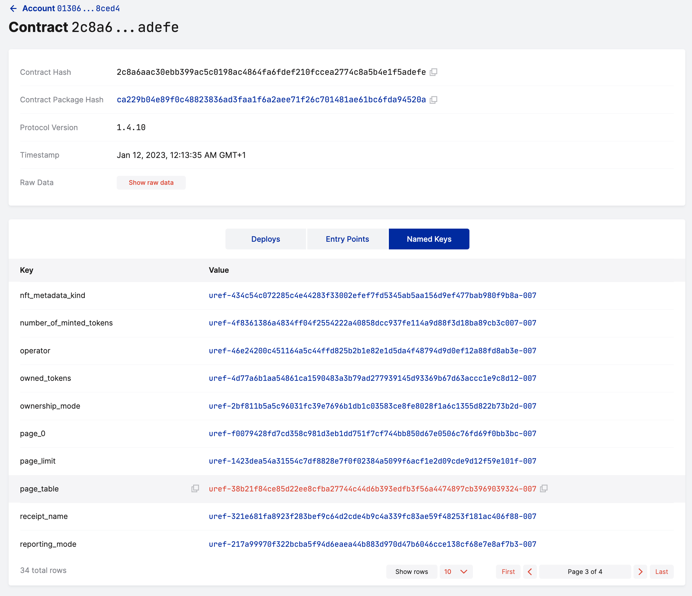
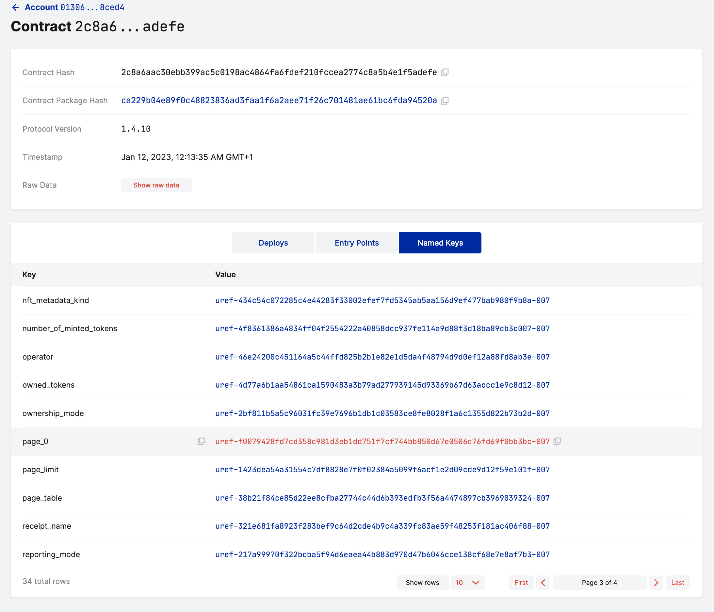
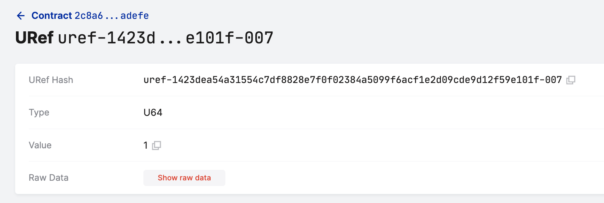

# Token Ownership in Casper NFT Contracts (Release v1.1.1)

This tutorial demonstrates how to check token ownership in CEP-78 NFT contracts, starting with version [v1.1.1](https://github.com/casper-ecosystem/cep-78-enhanced-nft/releases/tag/v1.1.1). As an account user or owner of a contract interacting with the NFT contract, I want to be able to answer the following questions:

1. Which NFTs do I own?
2. Which NFTs does someone else own?

The first method to answer these questions is an [account-centric approach](#querying-the-account), in which we trust the account owner and the information stored in the account's NamedKeys. This account could be an account we own, or someone else owns. This method is less secure and needs to be based on trust.

The second method is a [contract-centric approach](#querying-the-contract), in which we interrogate the NFT contract directly to retrieve token ownership information. This method is more secure than the first approach and can be used when we need to verify or cannot trust an account's NamedKeys. 

> **Note**: Please choose the most secure method that serves your use case based on the level of trust required.

## Prerequisites

- You have installed or upgraded to a CEP-78 contract that uses release v1.1.1. 
- The contract has minted one or more tokens, and you have access to the account or the contract that owns these tokens.
- You have experience with the [Casper CEP-78 NFT Standard](https://github.com/casper-ecosystem/cep-78-enhanced-nft/) and the Casper command-line client and know how to interact with a Casper network.
- You understand the [The CEP-78 Page System](../README.md#the-cep-78-page-system) introduced in [Version 1.1](https://github.com/casper-ecosystem/cep-78-enhanced-nft/#new-in-version-11) of the CEP-78 Enhanced NFT Standard.

## Querying the Account

To check token ownership by examining NamedKeys, we examine the account or the calling contract's NamedKeys. We look for NamedKeys that use this format: `cep78_[COLLECTION_NAME]_m_1000_p_X. For more information on this format, read about the [CEP-78 Page System](../README.md#the-cep-78-page-system). If we have such a key in the account, we can access the dictionary storing the NFTs and retrieve ownership information.

Let's consider an example where the contract minted a small number of NFTs and has the following NamedKey: `cep78_CEP-78-collection_m_1000_p_0`. We can query the dictionary stored under this NamedKey to retrieve the tokens that this account owns.



We will use the `casper-client` and its `get-dictionary-item` option to query this dictionary. Given the dictionary's address and the latest state root hash, the command would look like this:

**Sample query into the "cep78_*_m_1000_p_0" dictionary:**

```bash
casper-client get-dictionary-item  \
--node-address http://65.21.235.219:7777  \
--state-root-hash a77af17080112066caeb73d8133752584ddd11407f1fae94be0849a8abe1d1f9 \
--dictionary-address dictionary-eb837c4c92199e66619e163271a7e487704b5be7b103e785ed5b262f36ab6f50
```

Here is some sample output that we will discuss in more detail below. The list of boolean values would have 1,000 rows, but we have omitted most rows, because only the first two values in this example are set to "true".

**Sample response from the "cep78_*_m_1000_p_0" dictionary:**

```json
{
  "id": -5901481722405843563,
  "jsonrpc": "2.0",
  "result": {
    "api_version": "1.4.10",
    "dictionary_key": "dictionary-eb837c4c92199e66619e163271a7e487704b5be7b103e785ed5b262f36ab6f50",
    "merkle_proof": "[39498 hex chars]",
    "stored_value": {
      "CLValue": {
        "bytes": "[2008 hex chars]",
        "cl_type": {
          "List": "Bool"
        },
        "parsed": [
          true,
          true,
          false,
          false,
          false,
           ...
          false,
          false
        ]
      }
    }
  }
}
```

To interpret the output, we need to know how the token identifier mode was set at the time of contract installation. 

### Tokens Identified by Token ID

If the token identifier mode was set to "Ordinal", the token number is the token ID. In this case, the output above tells us that this account owns the first two tokens in the list. Also, the NamedKey `cep78_CEP-78-collection_m_1000_p_0` tells us that we are on page 0. By doing the math explained [here](../README.md#the-cep-78-page-system) and considering that the token number is the token ID, we conclude that the account owns tokens 0 and 1.

#### Another example

What if the named key was `cep78_CEP-78-collection_m_1000_p_11` for the same sample output? In that case, the account would own tokens on page 11, at index 0 and 1, which would be tokens 11,000 and 11,001.

### Tokens Identified by Hash

If the token identifier mode was set to "Hash" when the NFT contract was installed, we need to do some additional work and query the "index_by_hash" dictionary, and map all the token numbers to each token's hash. 

 

In this example query, we need to specify the dictionary name (index_by_hash) and index values 0 and 1 to retrieve the corresponding token hashes.

<!-- TODO add a screenshot, example query, and example output -->

## Querying the Contract

The second way to check token ownership is to examine the NFT contract. To proceed, we need the contract hash.


The NFT contract should have a `page_table` NamedKey, which is the seed URef for the "page_table" dictionary. Using this dictionary and the account hash (without the prefix), we can find the pages tracking tokens owned by the account specified. 



**Sample query into the "page_table" dictionary:**

```bash
casper-client get-dictionary-item \
--node-address http://65.21.235.219:7777 \
--state-root-hash 6d004bb17a76e59d6c0fe6d25ecbdf9fb01ea3e7b16b0484c185761dfe70d181 \
--seed-uref "uref-38b21f84ce85d22ee8cfba27744c44d6b393edfb3f56a4474897cb3969039324-007" \
--dictionary-item-key "e861226c153eefc0ca48bf29c76bc305235151aebde76257bf9bbacb4fa041f7"
```

**Sample response from the "page_table" dictionary:**

```json
{
  "id": 3795029107185218759,
  "jsonrpc": "2.0",
  "result": {
    "api_version": "1.4.10",
    "dictionary_key": "dictionary-615dfe771cda776c65c233b90f5c5752774124e6f498ba32b28ab9e853ee203f",
    "merkle_proof": "[37500 hex chars]",
    "stored_value": {
      "CLValue": {
        "bytes": "0100000001",
        "cl_type": {
          "List": "Bool"
        },
        "parsed": [
          true
        ]
      }
    }
  }
}
```

The sample response includes only one "parsed" value equal to "true", meaning that one page was allocated at index 0 to track tokens owned by the account specified. In other words, the account with hash "e861226c153eefc0ca48bf29c76bc305235151aebde76257bf9bbacb4fa041f7" owns tokens tracked in the "page_0" dictionary. To understand the page structure further, review how the contract manages storage and token ownership [here](../README.md#the-cep-78-page-system).

Since the contract allocated the page at index 0 to track tokens, we expect to see a NamedKey called "page_0" in the NFT contract. Using the URef of the "page_0" dictionary and the account hash, we can get the token IDs that the account owns.



**Sample query into the "page_0" dictionary:**

```bash
casper-client get-dictionary-item \
--node-address http://65.21.235.219:7777 \
--state-root-hash 6d004bb17a76e59d6c0fe6d25ecbdf9fb01ea3e7b16b0484c185761dfe70d181 \
--seed-uref "uref-f0079428fd7cd358c981d3eb1dd751f7cf744bb850d67e0506c76fd69f0bb3bc-007" \
--dictionary-item-key "e861226c153eefc0ca48bf29c76bc305235151aebde76257bf9bbacb4fa041f7" 
```

**Sample response from the "page_0" dictionary:**

```json
{
  "id": -769907090820463941,
  "jsonrpc": "2.0",
  "result": {
    "api_version": "1.4.10",
    "dictionary_key": "dictionary-eb837c4c92199e66619e163271a7e487704b5be7b103e785ed5b262f36ab6f50",
    "merkle_proof": "[39498 hex chars]",
    "stored_value": {
      "CLValue": {
        "bytes": "[2008 hex chars]",
        "cl_type": {
          "List": "Bool"
        },
        "parsed": [
          true,
          true,
          false,
          false,
          false,
           ...
          false,
          false
        ]
      }
    }
  }
}
```

Notice that the output is the same as when we queried the dictionary directly using the first method, and the dictionary address "dictionary-eb837c4c92199e66619e163271a7e487704b5be7b103e785ed5b262f36ab6f50". So, we are now at the same step of interpreting the output as explained above, in the [Tokens Identified by Token ID](tokens-identified-by-token-id) and [Tokens Identified by Hash](tokens-identified-by-hash) sections.

### Another example

What if the value parsed from the "page_table" dictionary would look like this?

```bash
        "parsed": [
          false,
          true
```

In that case, the account specified in the request would own tokens in the "page_1" dictionary because the value at index 1 is "true", and the value at index 0 is "false".

### What is the "page_limit" NamedKey?

The "page_limit" NamedKey saves the maximum number of pages that can be allocated for tracking tokens minted by an NFT contract. If the page_limit is 1, then we know that the contract has set the maximum token supply to be less than or equal to 1,000.



### Why can't we use the balance dictionary?

The "balance" dictionary tracks how many tokens an account owns, not which tokens it owns.

### When is the "token_owners" dictionary useful?

The "token_owners" dictionary maps token IDs to token owners. So if you want to know who owns a specific token, use the "token_owners" dictionary. But, we cannot use this dictionary to answer which tokens a specific account owns.

## Conclusions

To answer the question "which NFTs does this account own", we need to know which pages were allocated to the account in the "page_table" dictionary and which page indices were set to true. These pages link to dictionaries containing token ownership information.

If you trust an account and want to see which NFT it owns, look at its NamedKeys. See how many NamedKeys in the format "m_1000_p_X" the account has for a given collection. Given these keys, you can directly access the dictionaries that track pages with token information. Using the state root hash and the dictionary address for each page, you can get the page out of the contract and access token ownership details.

If you don't trust the account, you need to do some additional work to figure out which pages have been allocated to the account in the NFT contract. You can find this information by first querying the "page_table" dictionary.

